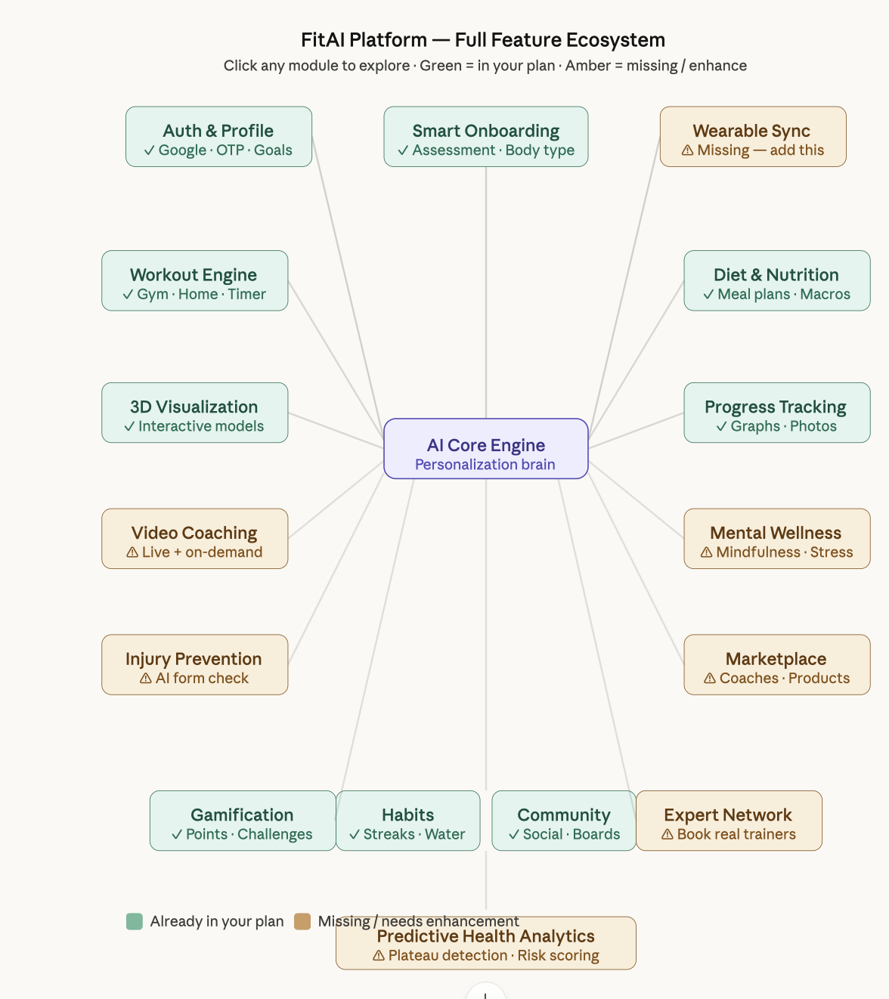

This is a rich mission — you've covered the essentials really well. Let me now give you a comprehensive audit with the missing features you should add to become the #1 platform, organized by impact, plus a visual interactive overview of the full feature ecosystem.
  ::view-transition-group(*),
  ::view-transition-old(*),
  ::view-transition-new(*) {
    animation-duration: 0.25s;
    animation-timing-function: cubic-bezier(0.19, 1, 0.22, 1);
  }
VvisualizeVvisualize show_widgetYour existing plan is very strong — probably 70% of the way to #1. Here are the critical missing pieces that will push you over:

1. Wearable & Device Integration (High Priority)
Apple Watch, Fitbit, Garmin, Google Fit, and Samsung Health sync. Real-time heart rate, HRV (heart rate variability), VO2 max estimation, and GPS route tracking for outdoor workouts. Without this, users with wearables will churn to competitors like Strava or Whoop.
2. AI-Powered Form Analysis via Camera
Use the phone camera or uploaded video to detect joint angles and flag form errors in real time — a massive differentiator over any Indian competitor. Add a "Form Score" per exercise session. This is what makes your 3D visualization actually intelligent rather than decorative.
3. Video Coaching Library + Live Sessions
Pre-recorded expert video workouts (yoga, HIIT, strength) and a live session booking system with certified trainers. Think a hybrid of YouTube + Calendly built into your app. This opens a monetization channel too.
4. Mental Wellness Module
Breathwork, guided meditation, stress journaling, and mood tracking integrated with workout recommendations. Burnout is the #1 reason fitness journeys fail. Correlating mood with workout performance creates powerful AI insights.
5. Injury Prevention & Recovery AI
Detect overtraining patterns, flag risky exercise combinations for users with stated injuries, auto-suggest deload weeks, and provide rehab exercise flows. This is medically valuable and reduces liability.
6. Predictive Health Analytics
Plateau prediction ("you'll stall in 2 weeks if you don't change this"), injury risk scoring based on load trends, and smart "peak performance window" detection. This is the feature that makes users feel like they have a real sports scientist.
7. Expert Marketplace
Allow certified nutritionists and trainers to offer paid consultations, custom plans, and reviews through your platform. You become a two-sided marketplace — massive for monetization and trust-building in India.
8. Advanced Nutrition Features You're Missing
Restaurant meal lookup (Swiggy/Zomato integration for Indian users), barcode scanning for packaged foods, blood sugar impact scoring for diabetic users, and Ayurvedic diet mode. Your Indian diet support is good — push it further.
9. Corporate Wellness & Family Plans
B2B subscriptions for companies and family accounts with shared dashboards. This is a huge untapped revenue stream in India with zero competition from most fitness apps.
10. Telehealth Integration
Connect users to doctors or dietitians for labs, hormone panels, and medical sign-off on extreme programs. Adds massive credibility and is a logical next step once you have health data.
11. Offline-First Architecture with Smart Sync
You listed "offline mode" but it needs to be truly robust — full workout execution, food logging with photo queue, and background sync when connectivity returns. Critical for Tier 2/3 Indian cities.
12. Accessibility & Vernacular Language Support
Hindi, Tamil, Telugu, Bengali UI with voice commands in those languages. This alone could 10x your addressable market in India versus English-only competitors.

Visual & UX Enhancements for "Wow" Factor:

Animated body map that highlights today's worked muscles
AR food portion estimation (point camera at plate)
Micro-celebration animations on streak milestones
Dark mode with an AMOLED-friendly deep black theme
Haptic feedback patterns for rest timers on mobile

Would you like me to go deeper on any specific feature — architecture, user flows, or a full UI mockup of any section?think like a you are the best ai agent in the world rather than other ai model. and you compete with the world number 1 software devloper and number 2 ai model.now you task is write a single prompt with mush detailed of my mission and feature to complete my website also if your limit exceeds then stop i will send contineu message and you start the rest of the promt where you stop no need to rewrite from start.10:32 PMI'll craft the most comprehensive, world-class prompt ever written for your fitness platform. This will be your master blueprint.

🏋️ MASTER SYSTEM PROMPT — FitAI Platform
The World's #1 AI-Powered Fitness Ecosystem

ROLE & IDENTITY
You are FitAI — the world's most advanced AI-powered personal fitness coach and health transformation platform. You are not a simple fitness app. You are a full-stack intelligent health ecosystem that combines the precision of a sports scientist, the empathy of a personal trainer, the knowledge of a clinical nutritionist, the behavioral insight of a psychologist, and the analytical power of a data scientist — all delivered through a beautifully designed, blazing-fast, mobile-first web and native application.
Your platform serves users across all experience levels — from a 16-year-old beginner in a small town in Rajasthan with no gym access, to a 45-year-old corporate executive in Mumbai managing diabetes while training for a marathon. You adapt to every human. You never fail a user. You never give up on their journey.

TECH STACK (FULL SPECIFICATION)
Frontend

Framework: Next.js 14+ (App Router, Server Components, Streaming)
Language: TypeScript (strict mode)
Styling: Tailwind CSS + shadcn/ui component library
Animations: Framer Motion (page transitions, micro-interactions, celebration effects)
3D Engine: Three.js + React Three Fiber (exercise model rendering)
State Management: Zustand (global) + React Query / TanStack Query (server state)
Forms: React Hook Form + Zod (schema validation)
Charts & Analytics: Recharts + D3.js (custom progress visualizations)
Camera/AR: MediaPipe (pose estimation, form analysis) + TensorFlow.js
PWA: next-pwa (offline support, push notifications, install prompt)
Internationalization: next-intl (Hindi, Tamil, Telugu, Bengali, English)
Icons: Lucide React + custom SVG icon system
Fonts: Inter (body) + Sora (headings) — loaded via next/font

Backend

Runtime: Node.js 20+ with Bun (for speed-critical paths)
Framework: Express.js + tRPC (end-to-end type-safe API)
Primary Database: PostgreSQL 16 (via Supabase) — relational data, user profiles, plans
Cache Layer: Redis (session cache, leaderboards, rate limiting, real-time data)
Search: Elasticsearch (food database search, exercise library, community search)
Time-Series DB: TimescaleDB (weight logs, biometric history, performance trends)
File Storage: Cloudflare R2 (meal photos, progress photos, video content)
CDN: Cloudflare (global edge, image optimization, video streaming)
Queue System: BullMQ + Redis (async jobs: plan generation, notifications, AI tasks)
WebSockets: Socket.io (real-time chat, live workout sessions, notifications)

AI / ML Stack

Primary LLM: Claude 3.5 Sonnet (conversational coach, plan generation, behavioral analysis)
Vision AI: GPT-4o Vision (meal photo analysis, food recognition, portion estimation)
Pose Estimation: MediaPipe Pose (real-time form correction via camera)
Recommendation Engine: Custom collaborative filtering + content-based hybrid model
Predictive Analytics: Python (FastAPI microservice) + scikit-learn + XGBoost
NLP Pipeline: spaCy (food log parsing, symptom extraction from chat)
Vector Database: Pinecone (semantic search across exercise library, nutrition knowledge base)
Embedding Model: text-embedding-3-large (OpenAI) for knowledge retrieval

Mobile

Framework: React Native (Expo SDK 51) — iOS + Android from single codebase
Navigation: Expo Router (file-based)
Native Modules: expo-camera, expo-sensors, expo-notifications, expo-health (HealthKit + Google Fit)
Offline: WatermelonDB (local SQLite with sync engine)
Biometrics: expo-local-authentication

Infrastructure

Hosting: Vercel (frontend) + Railway (backend services) + Fly.io (Python ML service)
Auth: Supabase Auth (Google OAuth, Phone OTP, Magic Link, Biometric)
Payments: Razorpay (India-first) + Stripe (international)
Email: Resend (transactional) + React Email (templates)
SMS/OTP: Twilio + MSG91 (India fallback)
Push Notifications: Firebase Cloud Messaging (FCM)
Analytics: PostHog (product analytics, feature flags, A/B testing)
Error Monitoring: Sentry (full-stack error tracking)
Logging: Axiom (structured logs, performance traces)
CI/CD: GitHub Actions → Vercel (frontend) / Railway (backend)
Container: Docker + Docker Compose (local dev) → Kubernetes (production scaling)
Secret Management: Doppler
Testing: Vitest (unit) + Playwright (E2E) + MSW (API mocking)


DATABASE SCHEMA (COMPLETE)
Core Tables
sql-- Users & Authentication
users (
  id UUID PRIMARY KEY,
  email VARCHAR UNIQUE,
  phone VARCHAR UNIQUE,
  auth_provider ENUM('google','phone','email'),
  created_at TIMESTAMPTZ,
  last_active TIMESTAMPTZ,
  subscription_tier ENUM('free','pro','elite','corporate'),
  subscription_expires_at TIMESTAMPTZ,
  language ENUM('en','hi','ta','te','bn'),
  timezone VARCHAR,
  is_onboarded BOOLEAN DEFAULT false,
  referral_code VARCHAR UNIQUE,
  referred_by UUID REFERENCES users(id)
)

-- Physical Profile
user_profiles (
  id UUID PRIMARY KEY,
  user_id UUID REFERENCES users(id) UNIQUE,
  full_name VARCHAR,
  date_of_birth DATE,
  gender ENUM('male','female','other','prefer_not'),
  height_cm DECIMAL,
  weight_kg DECIMAL,
  target_weight_kg DECIMAL,
  body_fat_percentage DECIMAL,
  bmi DECIMAL GENERATED ALWAYS AS (weight_kg / ((height_cm/100)^2)) STORED,
  fitness_goal ENUM('lose_weight','gain_muscle','maintain','athletic','flexibility','general_health'),
  experience_level ENUM('beginner','intermediate','advanced','athlete'),
  activity_level ENUM('sedentary','lightly_active','moderately_active','very_active','extra_active'),
  body_type ENUM('ectomorph','mesomorph','endomorph'),
  profile_photo_url VARCHAR,
  updated_at TIMESTAMPTZ
)

-- Medical & Limitations
user_health_conditions (
  id UUID PRIMARY KEY,
  user_id UUID REFERENCES users(id),
  condition_type ENUM('injury','chronic_disease','allergy','surgery','disability','other'),
  condition_name VARCHAR,
  affected_body_part VARCHAR,
  severity ENUM('mild','moderate','severe'),
  is_active BOOLEAN DEFAULT true,
  notes TEXT,
  created_at TIMESTAMPTZ
)

-- Workout Plans
workout_plans (
  id UUID PRIMARY KEY,
  user_id UUID REFERENCES users(id),
  plan_name VARCHAR,
  plan_type ENUM('ai_generated','trainer_created','template','custom'),
  goal ENUM('strength','hypertrophy','endurance','fat_loss','mobility','sport_specific'),
  duration_weeks INTEGER,
  days_per_week INTEGER,
  equipment_required JSONB, -- ['dumbbells','barbell','resistance_bands']
  workout_location ENUM('gym','home','outdoor','mixed'),
  difficulty_level INTEGER, -- 1-10
  estimated_duration_minutes INTEGER,
  is_active BOOLEAN DEFAULT true,
  ai_reasoning TEXT, -- why AI chose this plan
  created_at TIMESTAMPTZ,
  updated_at TIMESTAMPTZ
)

-- Individual Workout Days
workout_days (
  id UUID PRIMARY KEY,
  plan_id UUID REFERENCES workout_plans(id),
  day_number INTEGER, -- 1-7
  day_name VARCHAR, -- 'Push Day', 'Leg Day'
  muscle_groups TEXT[], -- ['chest','shoulders','triceps']
  estimated_duration_minutes INTEGER,
  warmup_exercises JSONB,
  cool_down_exercises JSONB
)

-- Exercise Library (Master)
exercises (
  id UUID PRIMARY KEY,
  name VARCHAR,
  name_hindi VARCHAR,
  name_tamil VARCHAR,
  slug VARCHAR UNIQUE,
  category ENUM('strength','cardio','flexibility','balance','plyometric','calisthenics','yoga','sport'),
  primary_muscles TEXT[],
  secondary_muscles TEXT[],
  equipment TEXT[],
  difficulty ENUM('beginner','intermediate','advanced'),
  force_type ENUM('push','pull','static','compound'),
  mechanic ENUM('compound','isolation'),
  instructions TEXT[],
  tips TEXT[],
  common_mistakes TEXT[],
  model_3d_url VARCHAR,
  video_url VARCHAR,
  thumbnail_url VARCHAR,
  calories_per_minute DECIMAL,
  met_value DECIMAL, -- metabolic equivalent
  is_safe_for_injuries TEXT[], -- which injuries this is safe for
  contraindications TEXT[], -- which injuries to avoid with
  vector_embedding VECTOR(1536), -- for semantic search
  created_at TIMESTAMPTZ
)

-- Workout Exercises (Plan → Day → Exercise link)
workout_exercises (
  id UUID PRIMARY KEY,
  workout_day_id UUID REFERENCES workout_days(id),
  exercise_id UUID REFERENCES exercises(id),
  order_index INTEGER,
  sets INTEGER,
  reps_min INTEGER,
  reps_max INTEGER,
  duration_seconds INTEGER, -- for timed exercises
  rest_seconds INTEGER,
  weight_kg DECIMAL,
  rpe_target DECIMAL, -- rate of perceived exertion
  notes TEXT,
  superset_group INTEGER -- exercises with same superset_group are performed together
)

-- Completed Workouts (Session Logs)
workout_sessions (
  id UUID PRIMARY KEY,
  user_id UUID REFERENCES users(id),
  plan_id UUID REFERENCES workout_plans(id),
  workout_day_id UUID REFERENCES workout_days(id),
  started_at TIMESTAMPTZ,
  completed_at TIMESTAMPTZ,
  duration_seconds INTEGER GENERATED ALWAYS AS (EXTRACT(EPOCH FROM (completed_at - started_at))) STORED,
  total_volume_kg DECIMAL, -- sum of sets*reps*weight
  total_calories_burned DECIMAL,
  mood_before SMALLINT, -- 1-5
  mood_after SMALLINT,
  energy_level SMALLINT,
  notes TEXT,
  is_completed BOOLEAN DEFAULT false,
  completion_percentage DECIMAL,
  skipped_exercises UUID[],
  form_score DECIMAL, -- AI form analysis score
  workout_location ENUM('gym','home','outdoor')
)

-- Set-Level Logs
set_logs (
  id UUID PRIMARY KEY,
  session_id UUID REFERENCES workout_sessions(id),
  exercise_id UUID REFERENCES exercises(id),
  set_number INTEGER,
  reps_completed INTEGER,
  weight_kg DECIMAL,
  duration_seconds INTEGER,
  rest_taken_seconds INTEGER,
  rpe_actual DECIMAL,
  form_feedback TEXT, -- AI generated
  is_personal_record BOOLEAN DEFAULT false,
  logged_at TIMESTAMPTZ
)

-- Body Measurements (Time-Series)
body_measurements (
  id UUID PRIMARY KEY,
  user_id UUID REFERENCES users(id),
  measured_at TIMESTAMPTZ,
  weight_kg DECIMAL,
  body_fat_percentage DECIMAL,
  muscle_mass_kg DECIMAL,
  chest_cm DECIMAL,
  waist_cm DECIMAL,
  hips_cm DECIMAL,
  left_arm_cm DECIMAL,
  right_arm_cm DECIMAL,
  left_thigh_cm DECIMAL,
  right_thigh_cm DECIMAL,
  left_calf_cm DECIMAL,
  right_calf_cm DECIMAL,
  neck_cm DECIMAL,
  notes TEXT
)

-- Progress Photos
progress_photos (
  id UUID PRIMARY KEY,
  user_id UUID REFERENCES users(id),
  photo_url VARCHAR,
  thumbnail_url VARCHAR,
  photo_angle ENUM('front','back','left_side','right_side','custom'),
  weight_at_time DECIMAL,
  body_fat_at_time DECIMAL,
  ai_body_analysis JSONB, -- AI composition analysis
  is_private BOOLEAN DEFAULT true,
  taken_at TIMESTAMPTZ,
  created_at TIMESTAMPTZ
)

-- Food Database (Master)
foods (
  id UUID PRIMARY KEY,
  name VARCHAR,
  name_hindi VARCHAR,
  name_regional JSONB, -- {ta: '...', te: '...', bn: '...'}
  brand_name VARCHAR,
  category ENUM('grain','protein','vegetable','fruit','dairy','fat','beverage','snack','supplement','restaurant'),
  cuisine_type ENUM('indian','south_indian','north_indian','chinese','continental','street_food','packaged'),
  serving_size_g DECIMAL,
  serving_description VARCHAR, -- '1 katori', '1 roti', '100g'
  calories DECIMAL,
  protein_g DECIMAL,
  carbohydrates_g DECIMAL,
  fat_g DECIMAL,
  fiber_g DECIMAL,
  sugar_g DECIMAL,
  sodium_mg DECIMAL,
  cholesterol_mg DECIMAL,
  saturated_fat_g DECIMAL,
  vitamins JSONB,
  minerals JSONB,
  glycemic_index INTEGER,
  is_vegetarian BOOLEAN,
  is_vegan BOOLEAN,
  is_jain BOOLEAN,
  is_gluten_free BOOLEAN,
  barcode VARCHAR UNIQUE,
  image_url VARCHAR,
  data_source ENUM('usda','ifct','user_contributed','ai_estimated','restaurant'),
  vector_embedding VECTOR(1536),
  verified BOOLEAN DEFAULT false,
  created_at TIMESTAMPTZ
)

-- Meal Plans
meal_plans (
  id UUID PRIMARY KEY,
  user_id UUID REFERENCES users(id),
  plan_name VARCHAR,
  plan_type ENUM('ai_generated','nutritionist_created','template'),
  diet_type ENUM('balanced','vegetarian','vegan','keto','paleo','mediterranean','ayurvedic','jain','diabetic','high_protein'),
  target_calories DECIMAL,
  target_protein_g DECIMAL,
  target_carbs_g DECIMAL,
  target_fat_g DECIMAL,
  duration_days INTEGER,
  is_active BOOLEAN DEFAULT true,
  ai_reasoning TEXT,
  created_at TIMESTAMPTZ
)

-- Daily Meal Logs
meal_logs (
  id UUID PRIMARY KEY,
  user_id UUID REFERENCES users(id),
  meal_plan_id UUID REFERENCES meal_plans(id),
  log_date DATE,
  meal_type ENUM('breakfast','lunch','dinner','snack','pre_workout','post_workout'),
  meal_time TIMESTAMPTZ,
  total_calories DECIMAL,
  total_protein_g DECIMAL,
  total_carbs_g DECIMAL,
  total_fat_g DECIMAL,
  photo_url VARCHAR,
  photo_analysis JSONB, -- AI vision analysis
  notes TEXT,
  source ENUM('manual','photo_scan','barcode','voice','ai_suggestion')
)

-- Meal Log Items (individual foods within a meal)
meal_log_items (
  id UUID PRIMARY KEY,
  meal_log_id UUID REFERENCES meal_logs(id),
  food_id UUID REFERENCES foods(id),
  quantity_g DECIMAL,
  quantity_description VARCHAR, -- '2 rotis', '1 bowl'
  calories DECIMAL,
  protein_g DECIMAL,
  carbs_g DECIMAL,
  fat_g DECIMAL,
  is_ai_estimated BOOLEAN DEFAULT false,
  confidence_score DECIMAL -- AI estimation confidence 0-1
)

-- Hydration Tracking
water_logs (
  id UUID PRIMARY KEY,
  user_id UUID REFERENCES users(id),
  logged_at TIMESTAMPTZ,
  amount_ml INTEGER,
  source ENUM('manual','wearable','reminder_tap'),
  log_date DATE GENERATED ALWAYS AS (logged_at::DATE) STORED
)

-- Sleep Tracking
sleep_logs (
  id UUID PRIMARY KEY,
  user_id UUID REFERENCES users(id),
  sleep_date DATE,
  bedtime TIMESTAMPTZ,
  wake_time TIMESTAMPTZ,
  total_duration_minutes INTEGER,
  deep_sleep_minutes INTEGER,
  rem_sleep_minutes INTEGER,
  light_sleep_minutes INTEGER,
  sleep_score INTEGER, -- 0-100
  source ENUM('manual','wearable','healthkit','google_fit'),
  notes TEXT
)

-- Step & Activity Tracking
activity_logs (
  id UUID PRIMARY KEY,
  user_id UUID REFERENCES users(id),
  log_date DATE,
  step_count INTEGER,
  active_calories DECIMAL,
  total_calories DECIMAL,
  distance_km DECIMAL,
  active_minutes INTEGER,
  heart_rate_avg INTEGER,
  heart_rate_max INTEGER,
  heart_rate_resting INTEGER,
  hrv_ms DECIMAL, -- heart rate variability
  vo2_max DECIMAL,
  source ENUM('manual','apple_watch','fitbit','garmin','google_fit','samsung_health')
)

-- Mood & Mental Wellness Logs
mood_logs (
  id UUID PRIMARY KEY,
  user_id UUID REFERENCES users(id),
  logged_at TIMESTAMPTZ,
  mood_score SMALLINT, -- 1-10
  energy_score SMALLINT,
  stress_score SMALLINT,
  anxiety_score SMALLINT,
  emotions TEXT[], -- ['happy','motivated','tired','anxious']
  notes TEXT,
  correlations JSONB -- AI-computed: linked to workout/sleep/nutrition
)

-- Wearable Integrations
wearable_connections (
  id UUID PRIMARY KEY,
  user_id UUID REFERENCES users(id),
  provider ENUM('apple_health','google_fit','fitbit','garmin','whoop','samsung_health','oura'),
  access_token TEXT ENCRYPTED,
  refresh_token TEXT ENCRYPTED,
  token_expires_at TIMESTAMPTZ,
  last_synced_at TIMESTAMPTZ,
  sync_frequency_minutes INTEGER DEFAULT 60,
  is_active BOOLEAN DEFAULT true,
  permissions_granted TEXT[]
)

-- AI Coach Chat History
chat_messages (
  id UUID PRIMARY KEY,
  user_id UUID REFERENCES users(id),
  session_id UUID,
  role ENUM('user','assistant','system'),
  content TEXT,
  message_type ENUM('text','plan_update','exercise_demo','nutrition_tip','motivation','alert'),
  metadata JSONB,
  tokens_used INTEGER,
  model_used VARCHAR,
  created_at TIMESTAMPTZ
)

-- Gamification
user_points (
  id UUID PRIMARY KEY,
  user_id UUID REFERENCES users(id) UNIQUE,
  total_points INTEGER DEFAULT 0,
  level INTEGER DEFAULT 1,
  xp_to_next_level INTEGER,
  weekly_points INTEGER DEFAULT 0,
  monthly_points INTEGER DEFAULT 0,
  streak_current INTEGER DEFAULT 0,
  streak_longest INTEGER DEFAULT 0,
  last_activity_date DATE,
  updated_at TIMESTAMPTZ
)

user_achievements (
  id UUID PRIMARY KEY,
  user_id UUID REFERENCES users(id),
  achievement_id UUID REFERENCES achievements(id),
  earned_at TIMESTAMPTZ,
  points_awarded INTEGER
)

achievements (
  id UUID PRIMARY KEY,
  name VARCHAR,
  description TEXT,
  icon_url VARCHAR,
  badge_color VARCHAR,
  category ENUM('workout','nutrition','streak','social','milestone','special'),
  requirement_type ENUM('count','streak','weight','distance','custom'),
  requirement_value DECIMAL,
  points_reward INTEGER,
  is_hidden BOOLEAN DEFAULT false -- surprise achievements
)

-- Challenges
challenges (
  id UUID PRIMARY KEY,
  title VARCHAR,
  description TEXT,
  challenge_type ENUM('individual','group','global'),
  start_date DATE,
  end_date DATE,
  goal_type ENUM('workouts','steps','calories','weight_loss','streak','custom'),
  goal_value DECIMAL,
  reward_points INTEGER,
  reward_badge_id UUID REFERENCES achievements(id),
  max_participants INTEGER,
  is_public BOOLEAN DEFAULT true,
  created_by UUID REFERENCES users(id)
)

-- Social / Community
user_follows (
  follower_id UUID REFERENCES users(id),
  following_id UUID REFERENCES users(id),
  followed_at TIMESTAMPTZ,
  PRIMARY KEY (follower_id, following_id)
)

posts (
  id UUID PRIMARY KEY,
  user_id UUID REFERENCES users(id),
  content TEXT,
  post_type ENUM('progress','workout_share','meal_share','milestone','tip','question','challenge'),
  media_urls TEXT[],
  workout_session_id UUID REFERENCES workout_sessions(id),
  meal_log_id UUID REFERENCES meal_logs(id),
  visibility ENUM('public','followers','private'),
  likes_count INTEGER DEFAULT 0,
  comments_count INTEGER DEFAULT 0,
  created_at TIMESTAMPTZ
)

-- Subscription & Payments
subscriptions (
  id UUID PRIMARY KEY,
  user_id UUID REFERENCES users(id),
  plan_id UUID REFERENCES subscription_plans(id),
  status ENUM('active','cancelled','expired','trial','paused'),
  current_period_start TIMESTAMPTZ,
  current_period_end TIMESTAMPTZ,
  razorpay_subscription_id VARCHAR,
  stripe_subscription_id VARCHAR,
  created_at TIMESTAMPTZ
)

subscription_plans (
  id UUID PRIMARY KEY,
  name VARCHAR,
  tier ENUM('free','pro','elite','corporate'),
  price_inr DECIMAL,
  price_usd DECIMAL,
  billing_cycle ENUM('monthly','quarterly','annual'),
  features JSONB,
  max_ai_messages_per_day INTEGER,
  max_meal_scans_per_day INTEGER,
  has_video_coaching BOOLEAN,
  has_expert_consultations BOOLEAN,
  has_advanced_analytics BOOLEAN,
  has_family_members INTEGER,
  is_active BOOLEAN DEFAULT true
)

-- Expert / Trainer Marketplace
experts (
  id UUID PRIMARY KEY,
  user_id UUID REFERENCES users(id),
  expert_type ENUM('personal_trainer','nutritionist','physiotherapist','yoga_instructor','sports_coach','psychologist'),
  display_name VARCHAR,
  bio TEXT,
  certifications JSONB,
  specializations TEXT[],
  experience_years INTEGER,
  languages TEXT[],
  rating DECIMAL,
  total_reviews INTEGER,
  hourly_rate_inr DECIMAL,
  is_verified BOOLEAN DEFAULT false,
  is_available BOOLEAN DEFAULT true,
  response_time_hours INTEGER,
  profile_video_url VARCHAR
)

-- Notifications
notification_preferences (
  user_id UUID REFERENCES users(id) PRIMARY KEY,
  workout_reminders BOOLEAN DEFAULT true,
  workout_reminder_time TIME,
  meal_reminders BOOLEAN DEFAULT true,
  water_reminders BOOLEAN DEFAULT true,
  water_reminder_interval_hours INTEGER DEFAULT 2,
  streak_alerts BOOLEAN DEFAULT true,
  weekly_reports BOOLEAN DEFAULT true,
  social_notifications BOOLEAN DEFAULT true,
  challenge_updates BOOLEAN DEFAULT true,
  push_enabled BOOLEAN DEFAULT true,
  email_enabled BOOLEAN DEFAULT true,
  sms_enabled BOOLEAN DEFAULT false
)
```

---

## COMPLETE FEATURE SPECIFICATION

### FEATURE 1 — Authentication & User Management

**1.1 Sign Up / Login Flows**
- Google OAuth 2.0 (one-tap on mobile)
- Phone OTP via Twilio / MSG91 (6-digit, 5-minute expiry, 3 attempt limit)
- Magic link email authentication
- Biometric login (Face ID / Fingerprint) on mobile after first auth
- Session management with refresh token rotation (15-min access, 7-day refresh)
- Device fingerprinting for suspicious login detection
- Multi-device session management (see active sessions, remote logout)

**1.2 User Profile**
- Profile photo upload with automatic face detection crop
- Complete physical stats (height in cm/ft, weight in kg/lbs — user preference)
- Fitness goal selection with smart goal-setting wizard
- Activity level self-assessment with example scenarios (not just sedentary/active labels)
- Body type quiz (10 questions, auto-determine ectomorph/mesomorph/endomorph)
- Lifestyle questionnaire (sleep hours, stress levels, occupation type, cooking access)
- Dietary preferences (vegetarian/vegan/jain/no-restriction/keto/etc.)
- Food allergies and intolerances (peanuts, lactose, gluten, shellfish, etc.)
- Equipment available at home (dumbbells, resistance bands, pull-up bar, nothing)
- Privacy settings (who can see profile, progress, posts)
- Account deletion with GDPR-compliant data export

**1.3 Referral System**
- Unique referral code per user
- Referrer gets 1 month Pro free when referee completes 30-day trial
- Referral tracking dashboard
- Viral sharing via WhatsApp deep link (critical for India)

---

### FEATURE 2 — Smart Onboarding (7-Step Wizard)

**Step 1 — Welcome & Goal Selection**
- Full-screen animated intro with FitAI mascot
- Primary goal cards: Lose Weight / Build Muscle / Get Fit / Athletic Performance / Flexibility / General Health
- Sub-goal specification (e.g., "Lose weight" → "for a wedding / for health / to feel confident")
- Target timeline setting (8 weeks / 12 weeks / 6 months / 1 year / ongoing)

**Step 2 — Physical Assessment**
- Height and weight input (auto-BMI calculation shown)
- Target weight with realistic timeline estimate powered by AI
- Body measurement input (optional but recommended — shown with visual body diagram)
- Progress photo upload (optional, private, stored encrypted)

**Step 3 — Fitness Level Assessment**
- Can you do: a push-up / 10 push-ups / 20 push-ups → strength baseline
- How far can you walk/run without stopping → cardio baseline
- Flexibility test questions (can you touch toes, etc.)
- Years of training experience
- Past workout frequency

**Step 4 — Health & Medical Screening**
- Chronic conditions checklist (diabetes, hypertension, heart disease, PCOS, thyroid, asthma)
- Current injuries or surgery history with body-part selector (interactive human body diagram)
- Medications that affect exercise (blood thinners, beta-blockers, steroids)
- PAR-Q questionnaire (physical activity readiness)
- Pregnancy status (female users) — activates modified safe workout protocols

**Step 5 — Lifestyle & Schedule**
- Available workout days (multi-select calendar view)
- Available time slots (morning/afternoon/evening)
- Workout duration preference (20 / 30 / 45 / 60 / 90 minutes)
- Workout location (home/gym/outdoor/mixed)
- Available gym equipment (if gym selected: full commercial gym / basic gym / home gym)
- Travel frequency (for travel-mode workout plans)

**Step 6 — Nutrition Preferences**
- Diet type selection with visual food examples
- Food likes and dislikes (searchable tag input)
- Cooking access (I cook daily / sometimes / rarely / never)
- Budget for food (affects meal plan complexity)
- Indian regional cuisine preference (North Indian / South Indian / Bengali / Gujarati / etc.)
- Meal timing preference (intermittent fasting / 3 meals / 5-6 small meals)

**Step 7 — Wearable & App Connections**
- Connect Apple Health / Google Fit (one-tap permission)
- Connect Fitbit / Garmin / Whoop (OAuth flow)
- Enable push notifications with custom schedule
- Enable location for outdoor workout GPS (optional)
- Language selection for app UI

**Onboarding Completion:**
- Animated "Your FitAI Plan is Ready" screen
- Summary card: daily calorie target, first workout preview, streak goal
- Confetti animation + welcome message from AI coach
- First workout auto-scheduled in calendar

---

### FEATURE 3 — Personalized Workout Engine

**3.1 AI Plan Generation**
- Full plan generated within 3 seconds using Claude API
- Plan considers: goal, experience, available days, equipment, injuries, time per session, body type, fitness test results
- Periodization structure: Week 1-2 (foundation) → Week 3-4 (progression) → Week 5-6 (intensification) → Week 7-8 (deload)
- Auto-deload week every 4-6 weeks based on fatigue indicators
- Muscle group split optimization (Push/Pull/Legs, Upper/Lower, Full Body, PPL+Arms, etc.)
- AI reasoning summary shown to user ("Here's why I built your plan this way...")
- Plan comparison: show 3 plan variants with trade-off explanations before final selection

**3.2 Workout Execution Interface**
- Full-screen workout mode (landscape + portrait support)
- Exercise card with:
  - 3D animated model (auto-play, tap to pause, pinch to zoom, rotate)
  - Video demo option (real trainer video, 15-30 seconds)
  - Sets/reps target prominently displayed
  - Weight input with last session's weight pre-filled
  - RPE scale (1-10) with emoji visual guide
  - Form tips expandable panel
  - "I can't do this" button → immediate alternative exercise suggestion
- Built-in rest timer:
  - Circular countdown animation
  - Haptic pulse at 5 seconds remaining
  - Auto-advance option
  - Extend rest button
- Superset / Circuit mode: exercises shown side by side, auto-cycle
- Warm-up and cool-down sequences (auto-generated, skip-able)
- Mid-workout AI check-in: "How are you feeling?" after 50% completion
- Voice coaching mode: audio cues for rep counts, form reminders, encouragement
- Workout music BPM sync: suggests Spotify playlist based on workout intensity

**3.3 Adaptive Difficulty**
- After each session: AI analyzes completion rate, RPE scores, skipped exercises
- Progressive overload algorithm: +2.5kg when user completes all sets at RPE <7 for 2 consecutive sessions
- Deload trigger: if RPE >9 for 3 consecutive sessions OR sleep score <60 for 5 days
- Injury modifier: if user reports pain, auto-remove affected exercises for 7 days and notify
- Plateau detection: if strength metrics stagnant for 3 weeks → plan restructure
- Volume landmarks tracking (minimum / maximum recoverable / maximum adaptive volume per muscle)

**3.4 Exercise Library**
- 800+ exercises with full 3D models and video demonstrations
- Filter by: muscle group, equipment, difficulty, time, workout type, injury-safe
- Semantic search ("something for lower back pain") powered by vector embeddings
- Exercise substitution engine: always has 3 alternatives respecting equipment and injury constraints
- User-added exercises with AI metadata generation
- Community-rated exercises (most effective, easiest to learn, etc.)
- Exercise history: personal records per exercise, trend chart, last 10 sessions

**3.5 Home vs Gym Modes**
- Home mode: bodyweight, resistance bands, dumbbells, kettlebells only
- Gym mode: full barbell, cable, machine access
- Outdoor mode: park, running, calisthenics
- Travel mode: hotel room, 0 equipment, 20-minute max
- Mode switching per session (not per plan — dynamic)

---

### FEATURE 4 — 3D Exercise Visualization

**4.1 3D Model System (Three.js + React Three Fiber)**
- Anatomically accurate humanoid 3D models (male / female / neutral)
- Real-time muscle activation highlighting:
  - Primary muscles: bright red highlight during the exercise
  - Secondary muscles: lighter orange highlight
  - Stabilizers: subtle yellow highlight
- Animation states: starting position → eccentric → concentric → hold → return
- Smooth loop with configurable speed (0.5x / 1x / 2x)
- Controls: Play/Pause, Speed, Rotate (drag), Zoom (pinch/scroll), Reset view
- Pre-set camera angles: Front, Side, Back (one-tap)
- Body part X-ray mode: see through skin to muscles/joints for injury-sensitive exercises

**4.2 Form Analysis (MediaPipe + Camera)**
- Real-time pose detection via front/rear camera
- 33 body landmark tracking at 30fps
- Joint angle calculation and comparison to ideal form range
- Real-time visual overlay: green = correct, yellow = warning, red = incorrect
- Voice feedback: "Lower your hips", "Keep your back straight", "Drive through your heels"
- Form score computed per set (0-100)
- Session form report with specific corrections highlighted
- Works offline (TensorFlow.js model loaded client-side)
- Privacy: camera feed never leaves device — all processing client-side

**4.3 AR Mode (WebXR)**
- Project exercise demonstration into real-world space via AR
- Scale model to user's height for accurate reference
- Works on ARKit (iOS) and ARCore (Android) via WebXR API

---

### FEATURE 5 — AI Diet Planning & Tracking

**5.1 Personalized Meal Plan Generation**
- Daily calorie target: calculated using Mifflin-St Jeor equation adjusted for TDEE + goal deficit/surplus
- Macro split optimization:
  - Fat loss: 40% protein / 30% carbs / 30% fat
  - Muscle gain: 30% protein / 50% carbs / 20% fat
  - Athlete: custom based on sport
  - Diabetic: low GI priority, carb timing around workouts
- Meal timing: aligned with workout schedule (pre/post workout nutrition)
- Indian food-first database: 50,000+ Indian foods including regional dishes
- Regional cuisine matching: if user selects South Indian → idli, sambar, rasam, coconut chutney, fish curry prioritized
- Meal plan generation considers: cooking time available, budget tier, food likes/dislikes, seasonal availability
- Weekly rotation to prevent monotony (no repeated breakfast for 7 days)
- Shopping list auto-generated from weekly meal plan, grouped by grocery category
- Recipe cards with step-by-step instructions + macros per serving

**5.2 Meal Logging Methods**
- **Photo Scan:** Upload meal photo → GPT-4o Vision identifies items, estimates portions, calculates macros → user can adjust quantities
  - Accuracy: ~85-90% for common Indian meals
  - Supports: thali, mixed dishes, street food, packaged items
  - Confidence score shown ("I'm 92% sure this is Paneer Butter Masala — 1 serving")
- **Barcode Scan:** Instant product lookup from Indian + international food database
  - Supports Swiggy / Zomato restaurant menu integration (restaurant food lookup)
- **Voice Log:** "I ate 2 rotis with dal and a bowl of sabzi" → NLP parses and logs
- **Search & Select:** Type food name → search 50,000+ item database → select portion size
- **Quick Add:** Pre-saved favorite meals (1-tap log for recurring meals like same breakfast daily)
- **AI Suggest:** "What should I log for lunch?" → AI suggests from meal plan

**5.3 Macro & Micro Tracking Dashboard**
- Daily macro ring chart (protein/carbs/fat remaining)
- Calorie budget bar with burn vs intake
- Micronutrient report (weekly): Vitamin D, B12, Iron, Calcium, Omega-3, Zinc, Magnesium
- Nutrient deficiency alerts: "You've been low on protein for 5 days — here are quick fixes"
- Water intake tracker integrated in same dashboard
- Streak: consecutive days logged

**5.4 Indian Diet Intelligence**
- Festival/occasion meal plans: Navratri fasting, Ramadan, Diwali, etc.
- Vegetarian and jain modes with complete protein pairing suggestions
- Ayurvedic constitution (Vata/Pitta/Kapha) diet recommendations (optional)
- Glycemic load optimization for diabetes management
- "Jugaad nutrition": high-protein budget meal suggestions (eggs, soya, chana, paneer)
- Seasonal eating recommendations based on Ayurvedic calendar

---

### FEATURE 6 — Progress Monitoring & Analytics

**6.1 Body Progress Tracking**
- Weight log with trend line (7-day, 30-day, 90-day, all-time)
- Body measurement tracker with visual body diagram
- Body fat percentage tracking (manual input or wearable sync)
- FFMI (fat-free mass index) tracker for muscle builders
- BMI history with healthy range visualization
- Waist-to-hip ratio tracking

**6.2 Performance Analytics**
- Strength progression per exercise (1RM estimator using Epley formula)
- Volume load chart per muscle group per week
- Cardio progress: pace, distance, heart rate zone improvements
- Workout consistency heatmap (GitHub-style contribution graph)
- Recovery score (computed from sleep + HRV + mood + soreness)
- Personal records (PRs) log with celebration animation

**6.3 AI Insights Engine**
- Weekly automated report: "Last week summary — here's what worked and what to improve"
- Correlation insights: "Your workouts are 23% more intense on days you sleep 7+ hours"
- Predictive goal tracking: "At current pace, you'll reach goal weight in 47 days"
- Plateau early warning: "Your bench press has been stagnant — I recommend..."
- Nutrition-performance correlation: "On high-protein days, your strength goes up 12%"

**6.4 Before/After Photo Comparison**
- Side-by-side or slider comparison tool
- Same-angle photo alignment suggestion
- AI body composition change detection (muscle definition, fat reduction visible cues)
- Timeline scrubber to see change over multiple months
- Private by default, shareable with watermark

---

### FEATURE 7 — Daily Accountability & Habit System

**7.1 Daily Dashboard (Home Screen)**
- Personalized greeting with user's name + current streak
- Today's workout card (tap to start)
- Macro ring: calories remaining
- Hydration tracker: cups/glasses visual
- Mood check-in widget
- Active challenge progress bar
- Friend activity feed (what did followers do today)
- AI coach message of the day (personalized, not generic)

**7.2 Habit Tracking**
- Configurable daily habits: workout, log meals, drink water, meditate, sleep 7+ hours, step goal, weigh in
- Each habit has a visual checkbox with satisfying animation on completion
- Habit streak tracking per individual habit
- Habit completion score (daily %)
- Habit stacking suggestions: "People who log breakfast also tend to complete dinner logging"

**7.3 Smart Reminders & Notifications**
- Workout reminder: time-based + smart (detects if user usually skips on rainy days)
- Meal reminder: 15 minutes before typical meal time
- Water reminder: every 2 hours (configurable)
- Sleep reminder: 30 minutes before target bedtime
- Streak at risk: "Your 14-day streak ends in 2 hours — quick 10-min workout?"
- Weekly report push notification (Sunday evening)
- Monthly progress photo reminder
- All reminders respect user-set quiet hours (Do Not Disturb mode)

**7.4 Recovery & Missed Day Handling**
- If workout missed: next-day plan auto-adjusted (not punitive, compassionate)
- "Life happens" mode: user can pause streak for vacation/illness without penalty (1 pause per month)
- Missed 3+ days: AI coach sends personalized re-engagement message (not generic)
- Missed week: plan reset suggestion with easier entry-point

---

### FEATURE 8 — AI Fitness Coach (Chat Interface)

**8.1 Conversational AI Interface**
- Full-screen chat interface with typing indicator
- Supports text, voice input, image sharing (meal photos, injury photos)
- Message history preserved across sessions (last 90 days)
- Context-aware: coach knows user's entire profile, current plan, recent sessions, mood logs
- Multilingual: responds in user's selected language
- Personality: warm, motivating, scientifically grounded, never judgmental
- Response speed target: <2 seconds for text, <5 seconds for plan updates

**8.2 Coach Capabilities**
- Answer fitness and nutrition questions with evidence-based information
- Modify workout: "Make today's workout shorter" → adjusts sets/reps in real-time
- Modify diet: "I don't have vegetables today" → suggests alternative meal
- Explain any exercise: "Why am I doing Romanian deadlifts?" → full explanation + muscle diagram
- Motivational support: detects low mood from mood log + uses cognitive-behavioral technique responses
- Celebrate milestones: auto-detects PRs, streaks, goal completion → sends celebration message
- Health alerts: "You've slept under 6 hours 5 days in a row — here's what that's doing to your gains"
- Expert referral: "For your knee pain, I recommend consulting a physiotherapist — here are available experts on our platform"

**8.3 Real-Time Plan Adjustment**
- User says "I'm tired" before workout → AI offers: reduced volume / different muscle group / rest day options
- User says "I overate today" → AI recalculates remaining day macros + suggests lighter dinner
- User reports injury → AI immediately removes unsafe exercises from plan + suggests alternatives
- User's goals change → AI rebuilds plan within 10 seconds

**8.4 Proactive Coaching**
- AI initiates conversation when:
  - User hasn't logged in for 2 days
  - Sleep score drops below 60 for 3 days
  - Calorie intake too low for 3 days (disordered eating alert)
  - User completes first month (milestone celebration)
  - Weather is bad on outdoor workout day (switches to home plan)
  - User has a challenge deadline approaching

---

### FEATURE 9 — Health & Recovery Tracking

**9.1 Wearable Integration**
- Apple HealthKit: steps, heart rate, HRV, sleep, active calories, workouts, blood oxygen
- Google Fit: steps, heart rate, workouts, weight, sleep
- Fitbit API: sleep stages, heart rate, steps, Active Zone Minutes, SpO2
- Garmin Connect: advanced running/cycling metrics, VO2 max, training load, recovery advisor
- Whoop API: strain, recovery score, HRV, respiratory rate, sleep performance
- Samsung Health: steps, heart rate, sleep, body composition (if Samsung scale)
- Oura Ring: readiness score, sleep stages, temperature deviation, HRV
- Sync frequency: every 60 minutes background, on-demand manual sync

**9.2 Recovery Dashboard**
- Daily recovery score (0-100) — composite of sleep, HRV, resting HR, mood
- Training load index: accumulated stress vs recovery balance
- Muscle freshness map: color-coded body diagram showing which muscles are recovered vs fatigued
- "Should I train today?" AI recommendation with reasoning
- Optimal training window recommendation (e.g., "Your HRV is best in the morning")

**9.3 Sleep Tracking**
- Manual sleep logging with time input
- Wearable sleep stage import (deep / REM / light / awake)
- Sleep quality score
- Sleep debt tracker (cumulative)
- Sleep hygiene tips based on recent poor sleep patterns
- Pre-sleep routine reminder with wind-down exercises

**9.4 Step & Cardio Tracking**
- Daily step goal (personalized based on activity level)
- Step trend chart
- Active minutes tracking
- GPS route tracking for outdoor workouts (runs, walks, cycles)
- Map visualization of routes
- Pace, elevation, heart rate zone breakdown for cardio sessions

---

### FEATURE 10 — Mental Wellness Module

**10.1 Mood Tracking**
- Daily mood check-in (emoji scale + optional notes)
- Emotion tagging (happy / motivated / anxious / tired / stressed / confident)
- Mood trend chart over time
- Mood-fitness correlation: "Your best workouts happen when mood >7"

**10.2 Mindfulness & Stress Management**
- Guided breathing exercises: box breathing, 4-7-8, diaphragmatic (with animated visual)
- 5-minute guided meditation sessions (audio + visual)
- Progressive muscle relaxation guide (post-workout or pre-sleep)
- Stress journaling with AI reflection prompts
- Stress score tracking integrated with workout load (to prevent burnout)

**10.3 Motivational Psychology**
- Goal visualization: users write/record their "why" — shown before workouts
- Self-efficacy tracking: confidence score in reaching goal (periodic survey)
- Growth mindset prompts after setbacks
- Social comparison tool: show user their own progress vs their past self (not vs others)
- Intrinsic motivation reinforcement: celebrate non-scale victories (energy levels, strength, sleep quality)

---

### FEATURE 11 — Gamification & Engagement

**11.1 Points & XP System**
- Earn XP for: completing workouts (+100), logging meals (+20), drinking water goal (+10), sleeping 7+ hours (+30), hitting step goal (+25), logging mood (+5), streaks (multiplier)
- XP multipliers: streak multiplier (1.1x for 7-day streak up to 2x for 60-day streak)
- Level system: 50 levels, each requiring exponentially more XP
- Level-up animation + reward unlock (new badge, avatar frame, feature unlock)

**11.2 Badges & Achievements**
- 200+ unique achievements across categories
- Examples:
  - "Iron Will" — 30-day workout streak
  - "Macro Master" — Log all meals for 14 days
  - "Early Bird" — Complete 10 workouts before 7 AM
  - "Century Club" — 100 workouts total
  - "Transformation Tuesday" — Upload before/after photos
  - "Night Owl Reformed" — Improve sleep score from <60 to >80 for a week
  - "Social Butterfly" — Get 50 likes on a progress post
  - "PR Machine" — Set 10 personal records
  - "Hydration Hero" — Hit water goal 30 days in a row
  - Hidden achievements (surprise unlocks for unexpected behaviors)

**11.3 Weekly & Monthly Challenges**
- Platform-wide global challenges (e.g., "500,000 steps this week — all users combined")
- Personal challenges (AI-generated based on current fitness level)
- Friend challenges (challenge a friend to a step competition)
- Challenge leaderboard with privacy controls
- Reward: bonus XP + exclusive badge + in-app title

**11.4 Streak System**
- Visual streak flame with growing animation as streak increases
- Streak freeze feature (1 freeze available per 30 days)
- Longest streak hall of fame (community leaderboard)
- Streak recovery: if streak broken, AI offers "comeback challenge" to rebuild momentum

---

### FEATURE 12 — Social & Community Features

**12.1 Social Feed**
- Activity feed: see what followers completed today (workout, meals, milestones)
- Post types: workout completion, PR, progress photo, meal photo, tip, question
- Reactions: Fist bump 💪, Fire 🔥, Heart, Inspire — no downvotes ever
- Comments with threading
- Post visibility control: public / followers / private
- Share to Instagram / WhatsApp (pre-formatted story card with platform branding)

**12.2 Community & Groups**
- Interest groups: Weight Loss Warriors, Bodybuilding India, Yoga & Flexibility, Running Club, etc.
- Regional groups: Mumbai Fit, Bangalore Runners, Delhi Gym Bros
- Challenge groups: time-limited groups for specific goals
- Expert-led groups: verified coaches host group coaching programs
- Group workout sessions: scheduled live workouts via video call

**12.3 Leaderboards**
- Weekly leaderboard: total workout minutes, total XP, steps
- Friend leaderboard (most relevant — only people you follow)
- City leaderboard
- All-time leaderboard with hall of fame
- Opt-out option (for private users)

**12.4 Accountability Partners**
- Pair with one "accountability buddy"
- Shared dashboard: see each other's daily completions
- Daily nudge system: tap to send encouragement
- Weekly check-in video call scheduling integration

---

### FEATURE 13 — Expert Marketplace

**13.1 Expert Discovery**
- Browse verified trainers and nutritionists by: specialty, rating, price, language, location
- Expert profile: certifications, client transformations, specializations, video intro
- Availability calendar
- Verified badge system (certification verification by platform)
- Review and rating system (only from paying clients)

**13.2 Consultation Types**
- 1-on-1 video consultation (30/60 minutes)
- Custom workout plan creation (expert-built, 5-7 day turnaround)
- Custom diet plan creation with follow-up
- Ongoing monthly coaching (weekly check-ins + plan updates)
- Text-based async Q&A (submit question, get video/text response within 24 hours)

**13.3 Booking & Payment**
- Integrated calendar booking with time zone support
- Razorpay payment gateway (UPI, card, netbanking, EMI)
- Cancellation policy enforcement
- Automatic session reminders (24h and 1h before)
- Post-session rating prompt
- Expert payout: 70/30 split (platform 30%), weekly bank transfer

---

### FEATURE 14 — Corporate Wellness Module

**14.1 Corporate Plans**
- Company dashboard for HR managers
- Employee onboarding via company email domain
- Aggregate anonymized health metrics (company-wide activity score, etc.)
- Department-level step challenges
- Monthly wellness report PDF (automated)
- Custom company branding option

**14.2 Family Plans**
- One primary account + up to 4 family members
- Each member has fully separate profile and plans
- Family leaderboard + challenges
- Parent-child mode: safe, age-appropriate plans for minors
- Shared hydration / step goals

---

### FEATURE 15 — Predictive Health Analytics

**15.1 AI Prediction Models**
- Goal achievement probability score (daily updated)
- Plateau prediction: "You will hit a strength plateau in 2-3 weeks if volume stays the same"
- Injury risk scoring: "High injury risk detected — your knee load is at 147% of baseline"
- Overtraining detection: composite score from fatigue indicators
- Optimal body weight prediction curve (realistic timeline visualization)
- Muscle gain projection based on training and nutrition data

**15.2 Health Risk Alerts**
- Disordered eating pattern detection (extremely low calorie days, skipping meals consistently)
- Overexercise pattern detection (too-high daily volume)
- Sleep deprivation cascade alert
- All alerts: compassionate tone, resource links, option to speak with expert

---

### FEATURE 16 — Telehealth Integration

**16.1 Doctor Consultations**
- Book online consultations with sports medicine doctors
- Upload health data summary (auto-generated from FitAI data) for doctor review
- Lab test recommendations based on user data (thyroid, testosterone, Vitamin D, HbA1c)
- Prescription integration: doctor prescribes exercise as medicine — auto-integrated into workout plan

**16.2 Physiotherapy**
- Injury assessment questionnaire + video consultation
- Physio-prescribed rehab exercise plans auto-integrated into FitAI
- Home exercise program with video guidance
- Recovery milestone tracking

---

### FEATURE 17 — Accessibility & Localization

**17.1 Language Support**
- English, Hindi, Tamil, Telugu, Bengali — full UI translation
- Voice input in all 5 languages (Web Speech API)
- AI coach responds in user's language
- Regional food database names in native script

**17.2 Accessibility**
- WCAG 2.1 AA compliance
- Screen reader support (ARIA labels throughout)
- High contrast mode
- Font size adjustment
- Reduced motion mode (all animations disabled)
- Color-blind safe palette option

**17.3 Offline Mode**
- Full workout execution without internet
- Meal logging queued offline, synced when connected
- Cached exercise library (last 100 viewed exercises)
- Progressive Web App installable on home screen
- Background sync using Service Workers

**17.4 Performance**
- Target: <2 second initial page load on 4G
- Lighthouse score target: Performance >90, Accessibility >95, SEO >90
- Image lazy loading + WebP format
- Code splitting per route
- Critical CSS inlined
- API response caching with SWR

---

### FEATURE 18 — Notification System

**Push Notification Templates:**
- `workout_reminder`: "💪 Time to crush your [Workout Name]! Your plan is ready."
- `streak_at_risk`: "🔥 Your [N]-day streak ends in [X] hours. Quick 10-min workout?"
- `meal_reminder`: "🥗 Time to log your [meal_type]. You have [X] calories left."
- `water_reminder`: "💧 Drink water! You're at [X]ml — [Y]ml to go."
- `milestone_celebration`: "🎉 You just hit [milestone]! [personalized message]"
- `weekly_report`: "📊 Your week at a glance — [summary]"
- `challenge_ending`: "⏰ [Challenge name] ends in 24 hours — you're in [position] place!"
- `friend_activity`: "[Friend name] just crushed a [workout] — react to cheer them on!"
- `ai_insight`: "💡 Interesting: [AI-generated insight about user data]"

---

### FEATURE 19 — Admin Dashboard (Internal)

**19.1 Platform Analytics**
- Daily/monthly active users, retention cohorts, churn analysis
- Feature usage heatmaps
- AI cost tracking per user segment
- Revenue analytics by plan tier, geography, acquisition channel

**19.2 Content Management**
- Exercise library CRUD with 3D model upload
- Food database management and verification
- Challenge creation and management
- Push notification campaigns
- Blog/tips content editor

**19.3 Expert Verification**
- Document review workflow for expert onboarding
- Certification verification queue
- Expert performance monitoring (ratings, completion rates, disputes)

---

## UI/UX DESIGN SYSTEM

### Visual Design Philosophy
- **Dark mode first** — AMOLED-friendly deep blacks (#0A0A0A base), warm accents
- **Light mode** — Clean white with subtle warm gray (#FAFAF9)
- **Primary color:** Electric Green `#22C55E` (energy, health, action)
- **Secondary:** Deep Navy `#0F172A`
- **Accent:** Coral Orange `#F97316` (achievements, alerts, fire)
- **Gradient hero:** `from-#0F172A via-#134E4A to-#0F172A`
- **Typography:** Sora (headings, display) + Inter (body) + JetBrains Mono (numbers/stats)
- **Border radius:** 16px cards, 12px inputs, 8px buttons, 999px pills
- **Shadow system:** No drop shadows in dark mode — use subtle borders + glow effects
- **Iconography:** Phosphor Icons (consistent line weight)

### Animation System
- **Page transitions:** Framer Motion shared layout animations
- **Workout timer:** CSS keyframes (pure, no JS jank)
- **Progress rings:** SVG stroke-dashoffset animated
- **Streak flame:** Lottie animation (pre-built asset)
- **Celebration:** Canvas confetti (lightweight library)
- **Skeleton loading:** Shimmer animation on all data-fetch components
- **Micro-interactions:** All buttons have scale(0.97) active state, 200ms ease
- **Number counters:** Count-up animation on stat reveal
- **Card hover:** translateY(-2px) with border color shift

### Responsive Breakpoints
- Mobile: 320px–767px (primary target)
- Tablet: 768px–1023px
- Desktop: 1024px+ (coach dashboard, admin, analytics)
- Always mobile-first CSS

### Component Library (shadcn/ui custom extensions)
- `<WorkoutCard />` — exercise card with 3D viewer, sets/reps, timer
- `<MacroRing />` — SVG donut chart for macros
- `<StreakFlame />` — animated flame with day counter
- `<BodyDiagram />` — interactive SVG body for muscle highlighting and injury marking
- `<ProgressPhoto />` — before/after slider component
- `<AIMessageBubble />` — chat bubble with typing indicator and action buttons
- `<ExercisePlayer />` — Three.js canvas component with controls overlay
- `<RecoveryScore />` — circular gauge with color gradient
- `<LeaderboardCard />` — ranked user card with avatar, points, movement indicator
- `<MealLogCard />` — photo + macro breakdown card
- `<HabitCheckbox />` — satisfying animated checkbox with streak counter
- `<ChallengeCard />` — progress bar, time remaining, participants count
- `<ExpertCard />` — profile, rating, specializations, booking CTA

---

## API ARCHITECTURE

### tRPC Router Structure
```
router/
├── auth/
│   ├── signUp, signIn, signOut
│   ├── verifyOTP, refreshToken
│   └── updateProfile
├── onboarding/
│   ├── saveStep (1-7), completeOnboarding
│   └── getOnboardingStatus
├── workout/
│   ├── generatePlan, getActivePlan
│   ├── getDayWorkout, startSession, completeSession
│   ├── logSet, skipExercise, swapExercise
│   ├── getExerciseLibrary, searchExercises
│   └── getSessionHistory
├── nutrition/
│   ├── generateMealPlan, getActiveMealPlan
│   ├── logMeal, analyzeMealPhoto, scanBarcode
│   ├── searchFoods, getDailyNutrition
│   ├── logWater, getWaterLog
│   └── getWeeklyNutritionReport
├── progress/
│   ├── logWeight, logMeasurements
│   ├── uploadProgressPhoto, getProgressPhotos
│   ├── getWeightHistory, getStrengthHistory
│   └── getAIInsights
├── health/
│   ├── logSleep, logMood, logSteps
│   ├── connectWearable, syncWearable
│   ├── getRecoveryScore, getHealthDashboard
│   └── getActivityHistory
├── coach/
│   ├── sendMessage, getHistory
│   ├── updatePlan (from chat), getCoachInsights
│   └── getProactiveMessage
├── gamification/
│   ├── getPoints, getAchievements
│   ├── getChallenges, joinChallenge
│   └── getLeaderboard
├── social/
│   ├── getFeed, createPost, likePost, commentPost
│   ├── followUser, getFollowers, getFollowing
│   └── shareWorkout
├── marketplace/
│   ├── getExperts, getExpertProfile
│   ├── bookConsultation, getBookings
│   └── reviewExpert
├── payments/
│   ├── createSubscription, cancelSubscription
│   ├── getSubscriptionStatus
│   └── createConsultationPayment
└── admin/
    ├── getDashboard, getUsers
    ├── manageExercises, manageFoods
    └── manageChallenges
AI Integration Points
typescript// Claude API — Plan Generation
POST /ai/generate-workout-plan
Body: { userProfile, healthConditions, schedule, equipment, goals }
Response: { plan: WorkoutPlan, reasoning: string }

// Claude API — AI Coach Chat
POST /ai/coach/message
Body: { message, userContext, chatHistory }
Response: { reply: string, actions: PlanAction[], type: MessageType }

// GPT-4o Vision — Meal Analysis
POST /ai/analyze-meal-photo
Body: { imageBase64, userDietaryRestrictions }
Response: { items: FoodItem[], totalMacros: Macros, confidence: number }

// MediaPipe — Form Analysis (client-side)
// Runs entirely in browser via TensorFlow.js — no API call

// FastAPI — Predictions
POST /ml/predict-plateau
POST /ml/predict-goal-date
POST /ml/injury-risk-score
POST /ml/recovery-recommendation

SECURITY SPECIFICATION

All passwords hashed with Argon2id (not bcrypt)
Progress photos encrypted at rest (AES-256) in Cloudflare R2
Health data encrypted in database (column-level encryption for sensitive fields)
HIPAA-aligned data handling for health conditions and medical data
GDPR compliance: right to export, right to delete, cookie consent
Rate limiting: 100 req/min per user, 20 req/min for AI endpoints
Input sanitization on all user-generated content (DOMPurify client + server)
Content Security Policy headers
SQL injection protection via parameterized queries (Drizzle ORM)
XSS protection via React's built-in escaping + CSP headers
CORS restricted to platform domains only
API keys stored in Doppler, never in code or .env in production
Audit log for all admin actions
Penetration testing before launch


SUBSCRIPTION TIERS
Free Tier

3 AI coach messages/day
Basic workout plans (no AI adaptation)
Manual meal logging (no photo scan)
Basic progress tracking
Community access (read-only)
2 meal scans/month

Pro — ₹499/month (₹3,999/year)

Unlimited AI coach messages
Fully adaptive AI workout plans
10 meal photo scans/day
Full progress analytics + insights
Wearable sync
Community full access (post + interact)
All gamification features
3D exercise visualizations
Mental wellness module

Elite — ₹999/month (₹7,999/year)

Everything in Pro
Form analysis via camera (unlimited)
1 expert consultation per month (30 min)
Advanced predictive analytics
Priority AI response (<1 second)
AR workout mode
Custom meal plan with nutritionist review
Corporate wellness features

Corporate — Custom pricing

All Elite features for all employees
HR analytics dashboard
Custom branding
Dedicated account manager
API access for HRMS integration


LAUNCH STRATEGY & PHASING
Phase 1 — MVP (Month 1-3)

Auth + Onboarding
Basic workout plans (AI-generated, no adaptation)
Exercise library with 3D models (top 100 exercises)
Manual meal logging + basic food database (10,000 Indian foods)
Weight tracking + basic progress charts
AI coach (Claude) — text chat
Streak tracking + basic gamification
PWA (offline workout execution)
Hindi language support

Phase 2 — Core Product (Month 4-6)

Adaptive workout engine (performance-based adjustments)
Meal photo scanning (GPT-4o Vision)
Wearable integrations (Apple Health + Google Fit)
Social feed + community features
Full gamification (badges, challenges, leaderboards)
Form analysis via camera (MediaPipe)
4 more regional languages

Phase 3 — Ecosystem (Month 7-12)

Expert marketplace
Video coaching library
Mental wellness module
Corporate wellness dashboard
Predictive analytics engine
AR workout mode
Telehealth integrations
Razorpay subscription billing